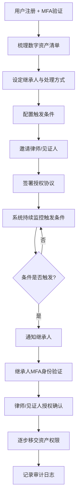
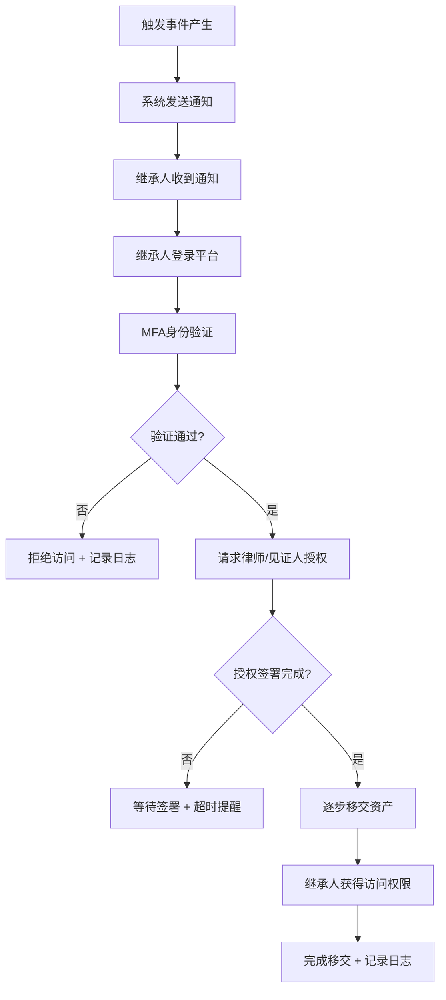

## 1. 产品概述

数字遗产规划与执行托管平台（DigitalLegacy）— 帮助用户安全梳理、托管和传承数字资产的全方位解决方案。用户可管理社交媒体、云存储、加密货币钱包、订阅服务等数字资产，设定继承人及处理方式，配置"数字遗嘱"触发条件，触发后系统自动通知继承人并逐步移交权限，全程多因素验证、律师/见证人授权、不可篡改审计日志保障安全与合规。

- 目标用户：拥有数字资产且关注身后传承的中高端个人用户、需要合规数字遗产托管服务的法律从业者
- 核心价值：让数字资产传承安全、合规、可追溯，避免数字资产因意外而永久丢失

## 2. 核心功能

### 2.1 用户角色

| 角色 | 注册方式 | 核心权限 |
|------|----------|----------|
| 资产所有者 | 邮箱注册 + MFA验证 | 管理资产、设定继承人、配置触发条件、查看审计日志 |
| 继承人 | 邮箱注册 + 身份验证 | 接收通知、验证身份、领取资产访问权限 |
| 律师/见证人 | 邮箱注册 + 执业认证 | 审核遗嘱、签署授权、参与资产移交流程 |
| 管理员 | 内部邀请 | 审核异常、系统配置、查看全局审计日志 |

### 2.2 功能模块

1. **仪表盘首页**: 资产概览、遗嘱状态监控、最近审计活动、待办事项
2. **数字资产管理**: 资产清单CRUD、分类管理（社交/云存储/加密货币/订阅）、资产详情编辑
3. **继承规划**: 设定继承人、分配资产处理方式、遗嘱条款编辑、触发条件配置
4. **遗嘱触发与执行**: 触发条件监控、触发事件通知、移交流程执行、多因素身份验证
5. **授权中心**: 律师/见证人角色管理、授权签署流程、MFA托管机制
6. **审计日志**: 不可篡改操作记录、时间线视图、筛选与导出

### 2.3 页面详情

| 页面名称 | 模块名称 | 功能描述 |
|----------|----------|----------|
| 登录/注册页 | 身份认证 | MFA多因素验证登录、邮箱注册、密码强度检测 |
| 仪表盘 | 资产概览卡片 | 显示资产总数、分类统计、遗嘱状态指示灯 |
| 仪表盘 | 触发条件监控 | 显示未登录天数倒计时、各条件状态 |
| 仪表盘 | 最近审计活动 | 展示最近10条审计日志摘要 |
| 数字资产页 | 资产清单列表 | 按分类展示所有资产，支持搜索筛选 |
| 数字资产页 | 资产添加/编辑 | 表单录入资产信息：类型、名称、凭证备注、继承人分配 |
| 数字资产页 | 资产分类筛选 | 社交媒体/云存储/加密货币/订阅服务 四大分类Tab |
| 继承规划页 | 继承人管理 | 添加/编辑/删除继承人信息及联系方式 |
| 继承规划页 | 遗嘱条款编辑 | 编辑遗嘱内容、处理方式、附加说明 |
| 继承规划页 | 触发条件配置 | 设定连续未登录天数阈值、自定义触发条件 |
| 遗嘱执行页 | 触发事件面板 | 显示已触发的遗嘱事件、当前执行阶段 |
| 遗嘱执行页 | 移交流程追踪 | 步骤式展示移交进度：通知→验证→授权→移交 |
| 遗嘱执行页 | 继承人身份验证 | 继承人MFA验证、身份文件上传 |
| 授权中心页 | 律师/见证人列表 | 管理授权参与人、查看签署状态 |
| 授权中心页 | 授权签署流程 | 逐步签署、电子签名、授权确认 |
| 授权中心页 | MFA托管设置 | 配置托管密钥、备用验证方式 |
| 审计日志页 | 操作记录时间线 | 时间线视图展示所有敏感操作 |
| 审计日志页 | 日志筛选与搜索 | 按操作类型、时间范围、角色筛选 |
| 审计日志页 | 日志详情与导出 | 查看单条日志完整信息、导出CSV |

## 3. 核心流程

用户注册并完成MFA验证后，进入平台梳理数字资产清单，为每项资产设定继承人和处理方式。然后配置"数字遗嘱"触发条件（如连续未登录天数阈值），并邀请律师/见证人参与授权。系统持续监控触发条件，一旦满足（如用户连续90天未登录），系统自动向继承人发送通知。继承人通过MFA身份验证后，在律师/见证人授权见证下，系统按预设流程逐步移交资产访问权限。全过程所有敏感操作均记录至不可篡改审计日志。

## 4. 用户界面设计

### 4.1 设计风格

- 主色调：深靛蓝 (#1B2A4A) + 琥珀金 (#D4A853)，传达信任感与庄重感
- 辅助色：雾灰 (#8B95A5)、翡翠绿 (#2ECC71 表示安全/完成)、珊瑚红 (#E74C3C 表示警告/危险)
- 按钮风格：圆角矩形（8px），主要按钮带微妙渐变和阴影，次级按钮描边风格
- 字体：标题使用 Playfair Display（衬线体，传达庄重权威），正文使用 DM Sans（清晰易读）
- 布局风格：左侧导航栏 + 右侧内容区，卡片式内容组织，信息密度适中
- 图标风格：线性图标，2px描边，搭配琥珀金点缀色
- 整体氛围：金融级安全感的暗色主题，带精致的渐变和玻璃拟态效果

### 4.2 页面设计概览

| 页面名称 | 模块名称 | UI元素 |
|----------|----------|--------|
| 登录/注册页 | 身份认证 | 居中卡片式表单、背景渐变动画、MFA验证码输入框、盾牌图标 |
| 仪表盘 | 资产概览卡片 | 4个统计卡片（资产总数/遗嘱状态/待处理/审计记录）、玻璃拟态效果 |
| 仪表盘 | 触发条件监控 | 圆环进度条显示倒计时、状态指示灯（绿/黄/红） |
| 仪表盘 | 最近审计活动 | 紧凑列表、时间戳、操作类型标签、用户头像 |
| 数字资产页 | 资产清单列表 | 分类Tab栏、资产卡片网格布局、搜索栏、分类图标 |
| 数字资产页 | 资产添加/编辑 | 滑入式侧边面板、分类选择器、表单验证提示 |
| 继承规划页 | 继承人管理 | 人物卡片、关系标签、联系方式展示 |
| 继承规划页 | 遗嘱条款编辑 | 富文本编辑器、条款编号列表、保存/草稿按钮 |
| 继承规划页 | 触发条件配置 | 数字输入框+滑块、条件卡片、启用/禁用开关 |
| 遗嘱执行页 | 移交流程追踪 | 步骤进度条（4步）、每步状态图标、时间戳 |
| 授权中心页 | 授权签署流程 | 签署卡片序列、电子签名区域、签署状态徽章 |
| 审计日志页 | 操作记录时间线 | 垂直时间线、操作类型色标、展开详情面板 |

### 4.3 响应式设计

- 桌面优先设计，最小宽度1280px完整体验
- 平板端（768-1280px）侧边栏收起为图标模式，卡片改为单列
- 移动端（<768px）底部Tab导航，简化卡片布局，触摸优化操作按钮

### 4.4 无3D场景需求
